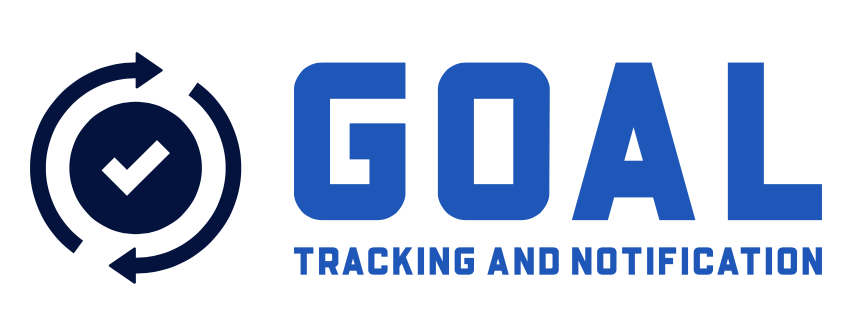

<h3 align="center">Goals and Tasks App</h3>

  
  

    A goals and task app to track what you need to do throughout the day.
     

<!-- ABOUT THE PROJECT -->
## About The Project
You can add, edit, delete, and complete tasks, along with notifications.
Data is stored securely within a person's account, using Google Firebase.
You must create an account to use this app. 

### Built With
[![React][React.js]][React-url]
[![Firebase][Firebase]][Firebase-url]
[![Expo][Expo]][Expo-url]

<!-- GETTING STARTED -->
## Getting Started
Modern IDEs will use the package.json to import things successfully using npm,
as listing all the packages would take too long here.
Expo Go is used to run and preview the app from source code.
To use Firebase successfully, you must create your own Firebase and put the key for that in the Firebase config file.

<!-- USAGE EXAMPLES -->
## Usage

<video width="320" height="240" controls>
  <source src="https://github.com/octtenz/Team-10/blob/c459c7f8612822d0ce4b2a42d7384bb958066b77/assets/video.mp4" type="video/mp4">
</video>

<!-- MARKDOWN LINKS & IMAGES -->
[React.js]: https://img.shields.io/badge/react_native-%2320232a.svg?style=for-the-badge&logo=react&logoColor=%2361DAFB
[React-url]: https://reactnative.dev/
[Firebase]: https://img.shields.io/badge/firebase-a08021?style=for-the-badge&logo=firebase&logoColor=ffcd34
[Firebase-url]: https://firebase.google.com/
[Expo]: https://img.shields.io/badge/expo-1C1E24?style=for-the-badge&logo=expo&logoColor=#D04A37
[Expo-url]: https://expo.dev/go

